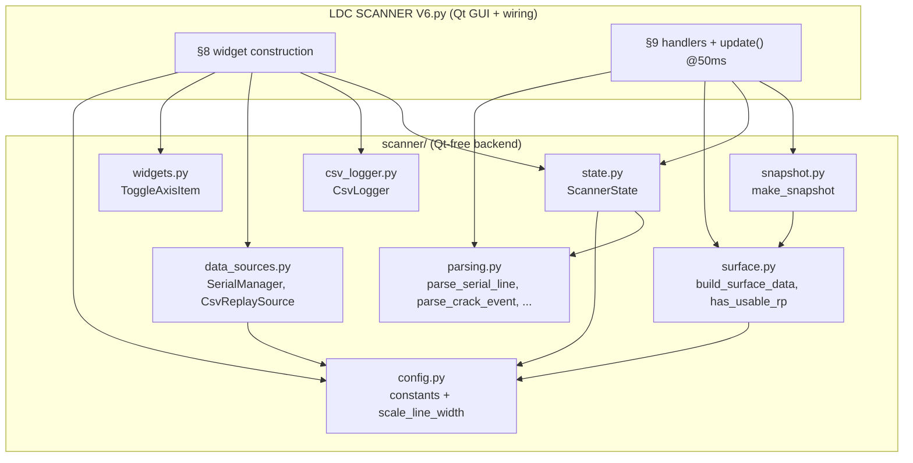
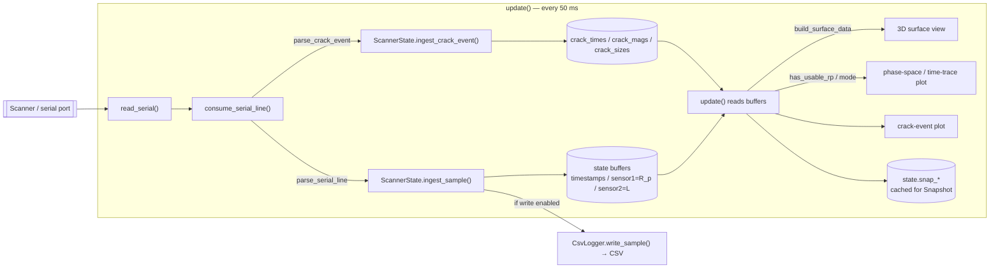
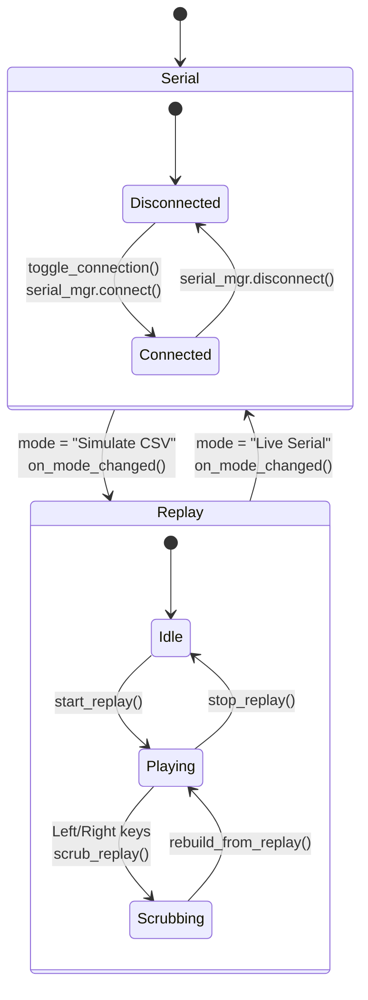
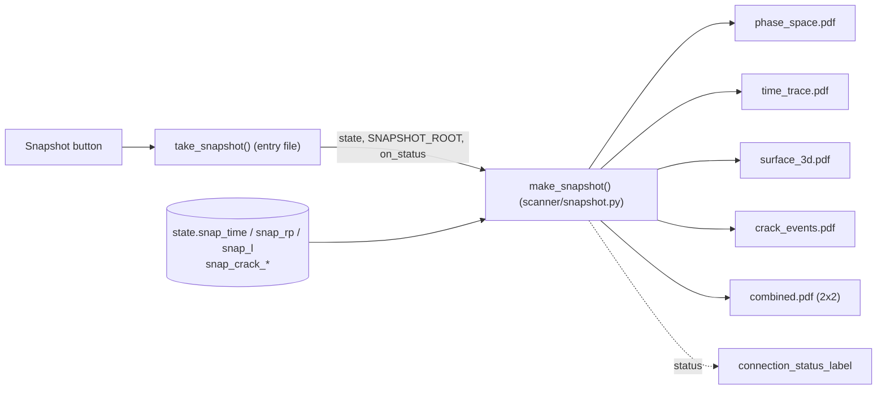

# LDC Scanner V6 — Architecture

This document maps the live eddy-current scanner GUI so you can find "what part
of the code does what" quickly. The Mermaid diagrams render on GitHub and in
VS Code (install *Markdown Preview Mermaid Support* if they don't).

> **Run it:** `python "LDC SCANNER V6.py"` from the repo root (so `import scanner`
> resolves). No device needed — the port stays closed until you connect in the UI.

---

## 1. Where the code lives

The Qt-free backend is the `scanner/` package; the GUI construction, the 50 ms
redraw loop, and all Qt event handlers stay in the single runnable entry file
`LDC SCANNER V6.py`.



Everything in `scanner/` is import-cycle-free and unit-testable without a display.
`ToggleAxisItem` is the one backend piece that subclasses pyqtgraph, so it sits in
`widgets.py` rather than the pure modules.

---

## 2. Live data flow (serial → screen)

One sample's journey, driven by a `QTimer` firing `update()` every 50 ms.



Key points:
- `state` (a single `ScannerState`) is the **central hub** — all buffers and view
  flags live there; handlers mutate it via `state.x`.
- The upper-right plot switches between **Phase Space** (L vs R_p) and **Time
  Trace** (L vs t); if R_p is flat/zero it auto-falls back to time (`has_usable_rp`).
- `update()` caches the exact plotted window into `state.snap_*` so a Snapshot
  reproduces what's on screen.

---

## 3. Live vs. replay: the `source` pointer

The read loop never knows whether it's reading hardware or a recording — it just
drains whatever `source` points at. Both classes expose the same interface
(`in_waiting` / `readline` / `reset_input_buffer` / `write` / `disconnect`).



- `source` is reassigned to `serial_mgr` or the active `CsvReplaySource` by
  `on_mode_changed()` / `start_replay()`.
- **Arrow-key scrubbing**: `scrub_replay()` moves the replay position, then
  `rebuild_from_replay()` clears the buffers and re-ingests the visible window
  (with `log=False`, so scrubbing never writes to CSV).
- Both sources call an optional `on_change` callback — the UI sets it to
  `set_connection_ui_state` so widget enable/visibility tracks connection state.

---

## 4. Snapshot export

The **Snapshot** button re-renders the four plots as journal-quality vector PDFs
(matplotlib, clean white style) rather than grabbing the dark GL widgets.



Output lands in `Snapshots/Snapshot <timestamp>/`. The 3D panel is raster inside
the PDF (the live view is OpenGL); the three 2D panels are true vector.

---

## 5. Code map (symbol → file)

| Symbol / responsibility | File |
|---|---|
| Serial / CSV / replay / plot constants, `scale_line_width` | `scanner/config.py` |
| `parse_serial_line`, `parse_keyed_fields`, `extract_reject_reason`, `parse_crack_event` | `scanner/parsing.py` |
| `build_surface_data`, `has_usable_rp` | `scanner/surface.py` |
| `ToggleAxisItem` (clickable axis) | `scanner/widgets.py` |
| `CsvLogger` (output CSV file) | `scanner/csv_logger.py` |
| `SerialManager`, `CsvReplaySource` | `scanner/data_sources.py` |
| `ScannerState` (buffers, view flags, snapshot cache) | `scanner/state.py` |
| `make_snapshot` (PDF export) | `scanner/snapshot.py` |
| Widget layout, plots, controls (§8) | `LDC SCANNER V6.py` |
| `update()` loop, key handlers, connection state machine, serial console (§9) | `LDC SCANNER V6.py` |

---

## 6. "Where do I change X?"

- **Tune a constant** (buffer size, replay speed, fade length, response limits):
  `scanner/config.py`.
- **Adjust plot line widths**: the `*_LINE_WIDTH_PERCENT` values in
  `scanner/config.py` (100 = original width).
- **Support a new serial field / message format**: `parse_serial_line` /
  `parse_keyed_fields` in `scanner/parsing.py`; if it should be logged, extend
  `CsvLogger.HEADER` + `write_sample` (`scanner/csv_logger.py`) and the
  `ingest_sample` signature (`scanner/state.py`).
- **Change the 3D surface shape/coloring**: `build_surface_data`
  (`scanner/surface.py`) — used by both the live GL view and the snapshot.
- **Change what a plot axis toggles to**: the `set_right_x_mode` /
  `set_crack_y_mode` handlers in the entry file, wired via `ToggleAxisItem`.
- **Add a keyboard shortcut**: `keyPressEvent` in the entry file (§9).
- **Change snapshot styling / labels / panels**: `make_snapshot`
  (`scanner/snapshot.py`) — `_SNAP_*` labels, the `style` dict, and the `panels`
  list.
- **Add a widget / control**: §8 of the entry file (widget construction), then
  wire its handler in §9.
```
