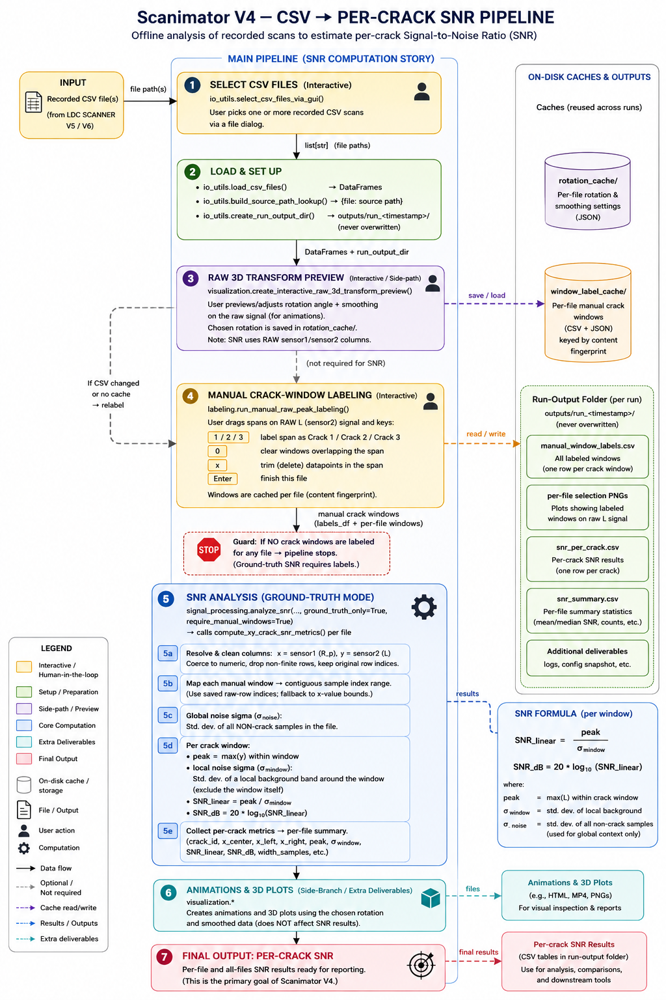

Use this branch for processing recorded scan data into SNR (signal-to-noise ratio) values and figures.

Don't use this branch for live experiments where data is streamed from the robot's ESP32 or a .csv file. For that, use the dual-streams branch!

There are two primary tools in this branch:

(1) Scanimator V4 turns CSV scans (recorded by LDC SCANNER V5/V6 on the dual-streams branch) into per-crack SNR estimates. You select the CSVs, manually mark where the cracks are, and it measures how strongly each crack stands out from the background noise — reported per crack and summarized per file — plus SNR charts, animations, and 3D plots. Run it with `python "Scanimator V4.py"`.

(2) SNR_Interactive_Analysis processes and visualizes SNR results (typically produced by Scanimator V4) in various ways. Open it in Jupyter and run the cells from top to bottom.

Install the dependencies with `pip install -r requirements.txt` before running either tool. Analysis settings (CSV column names, crack labels, colors, and output toggles) live in config.py. Each run writes to a fresh outputs/run_<timestamp>/ folder and never overwrites previous results; your manual crack windows and rotation choices are cached (in window_label_cache/ and rotation_cache/) so re-running a file skips the re-labeling step.

Scanimator V4 flowchart (CSV to per-crack SNR):

